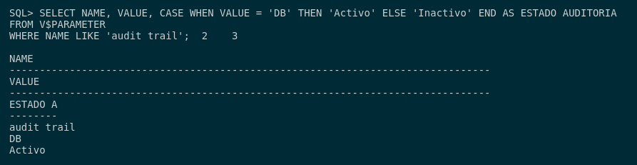
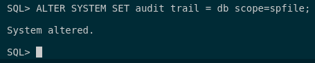
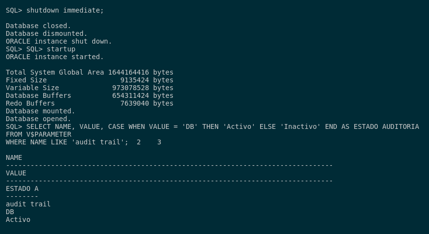
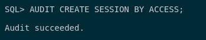
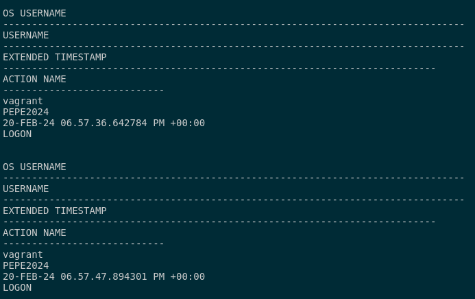
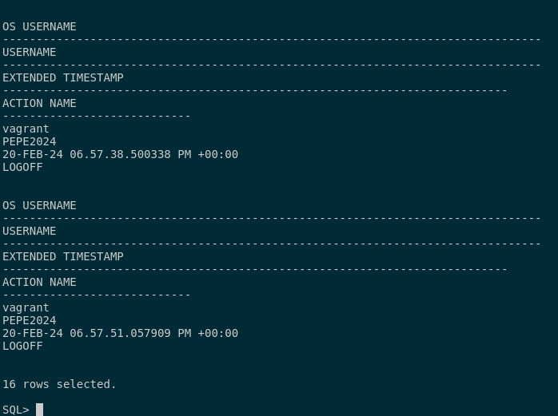

## 1. Activa desde SQL*Plus la auditoría de los intentos de acceso exitosos al sistema. Comprueba su funcionamiento.

Para ver los intentos de acceso exitoso al sistema, primero tendremos que ver si está activadas las auditorias en nuestro sistema. Por ello, realizaremos esta consulta:

```sql
SELECT NAME, VALUE, CASE WHEN VALUE = 'DB' THEN 'Activo' ELSE 'Inactivo' END AS ESTADO_AUDITORIA
FROM V$PARAMETER 
WHERE NAME LIKE 'audit_trail';
```



En mi caso, podemos ver que la auditoría está activa. Si por algún casual, nos devuelve la consulta anterior *Inactivo* tendremos que activar la auditoría con la siguiente directiva:

```sql
ALTER SYSTEM SET audit_trail = db scope=spfile;
```



Si queremos desactivar la auditoría, tendremos que ejecutar la siguiente directiva:

```sql
ALTER SYSTEM SET audit_trail = none scope=spfile;
```

Con esto dicho, activamos la auditoría y reinciamos la base de datos para que tengamos activado la auditoría de la base de datos. 

```sql
shutdown immediate;
startup;
```

Tras esto, comprobamps que esta activo con la primera consulta del ejercicio.

```sql
SELECT NAME, VALUE, CASE WHEN VALUE = 'DB' THEN 'Activo' ELSE 'Inactivo' END AS ESTADO_AUDITORIA
FROM V$PARAMETER 
WHERE NAME LIKE 'audit_trail';
```



Con la auditoría activa, vamos a activar que esta nos guarde los accesos exitosos al sistema con el siguiente comando:

```sql
AUDIT CREATE SESSION BY ACCESS;
```



Con esto hecho, pasamos a las pruebas. Lo que haremos será crear un usuario y darle permisos para poder conectarnos. 

```sql
CREATE USER pepe2024 IDENTIFIED BY "Pepe2024!" DEFAULT TABLESPACE USERS;
GRANT CONNECT TO pepe2024;
```

Cuando lo creemos, me loguearé 2 veces y me saldré para ver que las conexiones son existosas. Para ver que la auditoría funciona correctamente, tendremos que ejecutar la siguiente consulta:

```sql
SELECT OS_USERNAME, USERNAME, EXTENDED_TIMESTAMP, ACTION_NAME 
FROM DBA_AUDIT_SESSION;
```




