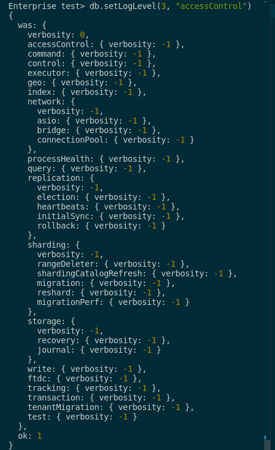
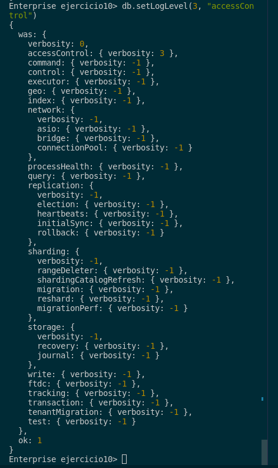
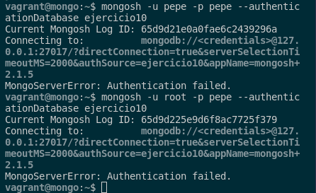

## 10. Averigua si en MongoDB se pueden auditar los accesos a una colección concreta. Demuestra su funcionamiento.

En MongoDB se pueden auditar los accesos a una colección concreta. Para ello, tendremos que ejecutar este comando en la consola de MongoDB Enterprise:

```sql
db.setLogLevel(3, "accessControl")
```



El número indica el nivel de verbosidad, siendo “0” equivalente a desactivado, y “5” el máximo y para hacer pruebas sobre ello, accederemos como administrador y crearemos una base de datos, un  usuario administrador sobre ella y algunos inserts:

```sql
use ejercicio10

db.createCollection("Compradores");
db.Compradores.insert({Nombre: "Pepe", Edad: 19});
db.Compradores.insert({Nombre: "Javier",  Edad: 20});

db.Compradores.find();
```

Tras esto, volveremos a ejecutar el comando anterior para activar la auditoría a una colección concreta:

```sql
db.setLogLevel(3, "accessControl")
```



Tras esto, para comprobar que la auditoría funciona correctamente, vamos a mirar los logs de MongoDB desde la consola con un formato JSON con el siguiente comando:

```sql
sudo cat /var/log/mongodb/mongod.log | jq
```

En este archivo nos muestra cosas importantes y por ello para hacer la prueba vamos a intentar acceder como un usuario que no existe y un usuario que existe pero con otra contraseña.

```sql
mongosh -u pepe -p pepe --authenticationDatabase ejercicio10
mongosh -u root -p pepe --authenticationDatabase ejercicio10
```



Y podemos ver dicho intento de logueo con el siguiente comando:

```sql
sudo cat /var/lib/mongodb/auditLog.json | jq
```


Con esto dicho, si queremos ver más información referente a este logueo, deberemos poner el nivel de verbosidad a 5 con el siguiente comando y volver a realizar las pruebas pertinentes:

```sql
db.setLogLevel(5, "accessControl")
```

Si queremos ver toda la información sobre la auditoría, deberemos ejecutar el siguiente comando:

```sql
db.setLogLevel(3)
```

Si queremos mayor nivel de detalle, tenemos que poner un nivel más alto de verbosidad como el 5. Y si no queremos activar todos los parametros, deberemos especificar los que realmente queramos. 

Los parámetros en cuestión son los siguientes:

- accessControl
- command
- control
- ftdc
- geo
- index
- network
- query
- replication
- replication.election
- replication.heartbeats
- replication.initialSync
- replication.rollback
- recovery
- sharding
- storage
- storage.journal
- transaction
- write

Si quereís saber lo que hace cada uno de estos parámetros, podemos informarnos en esta [documentación](https://www.mongodb.com/docs/manual/reference/method/db.setLogLevel/) oficial.