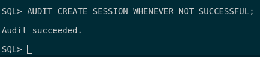
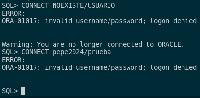
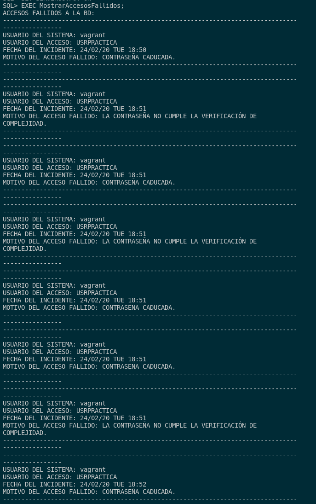
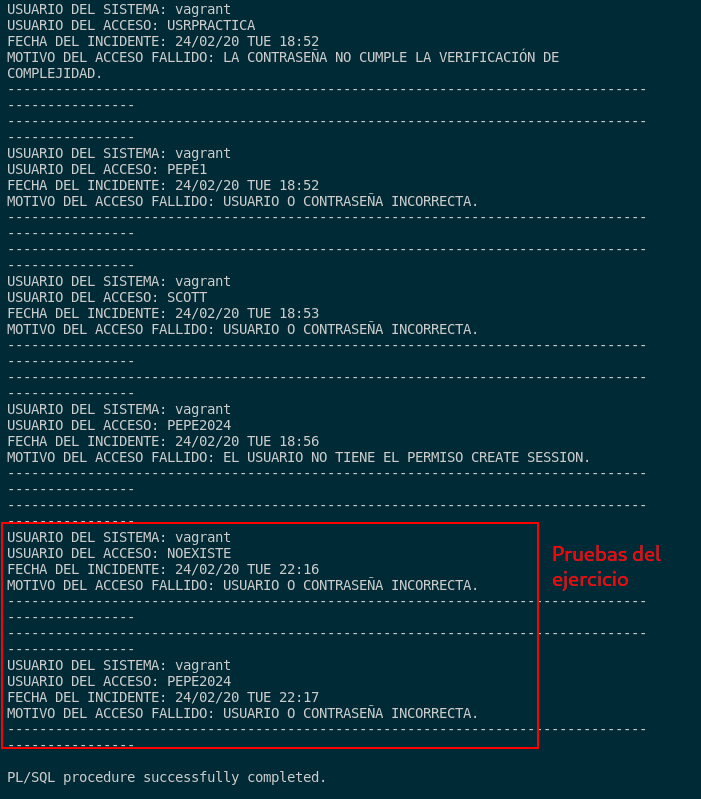

## 2. Realiza un procedimiento en PL/SQL que te muestre los accesos fallidos junto con el motivo de los mismos, transformando el código de error almacenado en un mensaje de texto comprensible. Contempla todos los motivos posibles para que un acceso sea fallido.

Primero, para poder realizar este procedimiento, tendremos que realizar una serie de preparativos que son los siguientes.

- Activar la auditoría de intentos de acceso fallidos. Esto lo haremos con ls siguiente directiva:

```sql
AUDIT CREATE SESSION WHENEVER NOT SUCCESSFUL;
```



- Comprobar que la auditoría funciona intentando a acceder a un usuario que no existe y un un usuario con una contraseña incorrecta.



Con esto comentado, pasamos a la creación del procedimiento. En mi caso, lo que he pensado es en hacer una función que devuelva el mensaje de error según un código de error que está en el sistema. 
Por ello, la función queda de la siguiente manera:

```sql
CREATE OR REPLACE FUNCTION PasarErrores (p_error NUMBER) 
RETURN VARCHAR2
IS
    v_error VARCHAR2(150);
BEGIN
    CASE p_error
        WHEN 911 THEN v_error := 'CONTIENE UN CARÁCTER INVÁLIDO.';
        WHEN 1004 THEN v_error := 'EL ACCESO SE HA DENEGADO.';
        WHEN 1017 THEN v_error := 'USUARIO O CONTRASEÑA INCORRECTA.';
        WHEN 1033 THEN v_error := 'USUARIO NO EXISTE.';
        WHEN 1045 THEN v_error := 'EL USUARIO NO TIENE EL PERMISO CREATE SESSION.';
        WHEN 28000 THEN v_error := 'USUARIO BLOQUEADO.';
        WHEN 28001 THEN v_error := 'CONTRASEÑA CADUCADA.';
        WHEN 28003 THEN v_error := 'LA CONTRASEÑA NO CUMPLE LA VERIFICACIÓN DE COMPLEJIDAD.';
        WHEN 28011 THEN v_error := 'LA CUENTA VA A CADUCAR PRONTO, DEBERÍAS CAMBIAR LA CONTRASEÑA.';
        WHEN 28511 THEN v_error := 'CONTRASEÑA EXPIRADA.';
        WHEN 28512 THEN v_error := 'CUENTA BLOQUEADA.';
        ELSE v_error := 'ERROR NO REGISTRADO EN EL SISTEMA';
    END CASE;
RETURN v_error;
END PasarErrores;
/
```

Seguido de esto haré un procedimienmto que nos muestre los errores mediante un cursor que nos muestre los accesos fallidos en el sistema y se queden guardados en **DBA_AUDIT_SESSION**. Tras esto, simplemente recorremos el cursor para poder ver los accesos no conseguidos.

```sql
CREATE OR REPLACE PROCEDURE MostrarAccesosFallidos
IS
    CURSOR C_ACCESOS IS
        SELECT OS_USERNAME, USERNAME, RETURNCODE, TIMESTAMP
        FROM DBA_AUDIT_SESSION
        WHERE ACTION_NAME='LOGON' AND RETURNCODE != 0
        ORDER BY TIMESTAMP;
    v_error VARCHAR2(100);
BEGIN
    DBMS_OUTPUT.PUT_LINE('ACCESOS FALLIDOS A LA BD:');
    FOR I IN C_ACCESOS LOOP
        v_error := PasarErrores(I.RETURNCODE);
        DBMS_OUTPUT.PUT_LINE('------------------------------------------------------------------------------------------------');
        DBMS_OUTPUT.PUT_LINE('USUARIO DEL SISTEMA: ' || I.OS_USERNAME);
        DBMS_OUTPUT.PUT_LINE('USUARIO DEL ACCESO: ' || I.USERNAME);
        DBMS_OUTPUT.PUT_LINE('FECHA DEL INCIDENTE: ' || TO_CHAR(I.TIMESTAMP,'YY/MM/DD DY HH24:MI'));
        DBMS_OUTPUT.PUT_LINE('MOTIVO DEL ACCESO FALLIDO: ' || v_error);
        DBMS_OUTPUT.PUT_LINE('------------------------------------------------------------------------------------------------');
    END LOOP;
END MostrarAccesosFallidos;
/
```

Pasamos a la prueba del procedimiento. Lo que haremos será ejecutar este mismo y nos devolverá las pruebas que hemos hecho:

```
EXEC MostrarAccesosFallidos;
```



