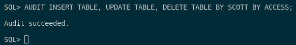
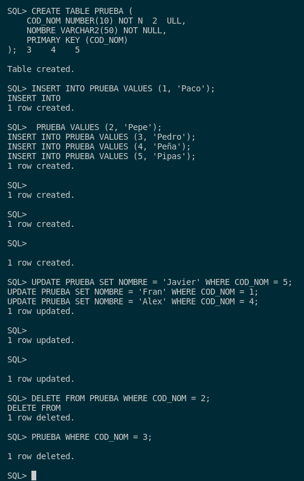
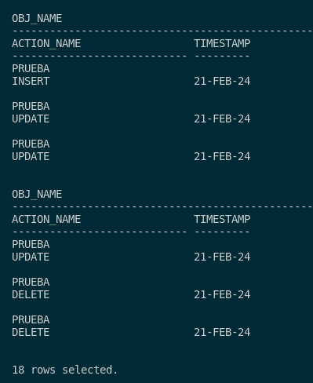

## 3. Activa la auditoría de las operaciones DML realizadas por SCOTT. Comprueba su funcionamiento.

Para poder activar la auditoría para realizar operaciones DML mediante SCOTT, tendremos que ejecutar la siguiente directiva:

```sql
AUDIT INSERT TABLE, UPDATE TABLE, DELETE TABLE BY SCOTT BY ACCESS;
```



Tras esto, pasamos a las pruebas. Estas las haremos accediendo a mi usuario SCOTT con su respectiva contraseña y crearemos una tabla cualquiera la cual añadiremos 5 datos, modificaremos 3 y borraremos 2.

Con esto dicho, aqui tenemos los inserts y las tablas:

```sql
CONNECT SCOTT/SCOTT;

CREATE TABLE PRUEBA (
    COD_NOM NUMBER(10) NOT NULL,
    NOMBRE VARCHAR2(50) NOT NULL,
    PRIMARY KEY (COD_NOM)
);

INSERT INTO PRUEBA VALUES (1, 'Paco');
INSERT INTO PRUEBA VALUES (2, 'Pepe');
INSERT INTO PRUEBA VALUES (3, 'Pedro');
INSERT INTO PRUEBA VALUES (4, 'Peña');
INSERT INTO PRUEBA VALUES (5, 'Pipas');

UPDATE PRUEBA SET NOMBRE = 'Javier' WHERE COD_NOM = 5;
UPDATE PRUEBA SET NOMBRE = 'Fran' WHERE COD_NOM = 1;
UPDATE PRUEBA SET NOMBRE = 'Alex' WHERE COD_NOM = 4;

DELETE FROM PRUEBA WHERE COD_NOM = 2;
DELETE FROM PRUEBA WHERE COD_NOM = 3;
```



Tras esto, accedemos como DBA y ejecutaremos la siguiente consulta para ver si la auditoría de objetos se ha realizado de manera perfecta.

```sql
SELECT OBJ_NAME, ACTION_NAME, TIMESTAMP
FROM DBA_AUDIT_OBJECT
WHERE USERNAME='SCOTT'
ORDER BY TIMESTAMP;
```


