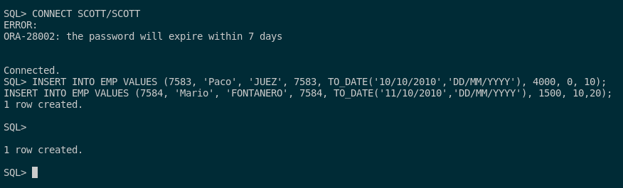
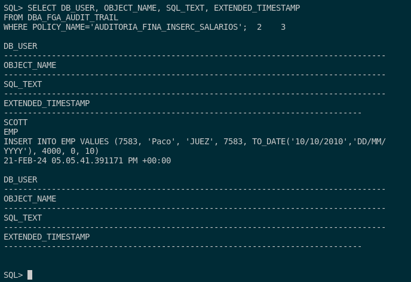

## 4. Realiza una auditoría de grano fino para almacenar información sobre la inserción de empleados con sueldo superior a 2000 en la tabla emp de scott.

Para realizar una auditoría de grano fino sobre nuestra base de datos para almacenar la información de inserción de los empleados con sueldo superior a 2000, debemos saber que necesitamos un bloque para ello.

Por ello, en este bloque, deberemos utilizar una directiva que es **DMBS_FGA.ADD_POLICY** que nos sirve para la auditoría de grano fino. Esta nos sirve para realizar auditorías de manera selectiva eligiendo campos específicos (en este caso es para determinar el valor del salario).

Con esto dicho, creamos este bloque:

```sql
BEGIN
    DBMS_FGA.ADD_POLICY (OBJECT_SCHEMA => 'SCOTT', OBJECT_NAME => 'EMP', POLICY_NAME => 'AUDITORIA_FINA_INSERC_SALARIOS', AUDIT_CONDITION => 'SAL > 2000', STATEMENT_TYPES => 'INSERT');
END;
/
```

Tras esto, pasamos a las pruebas. Para ello, lo que voy a hacer va a ser que voy a crear 2 empleados, uno con salario superior a 2000 y otro no. Estos son los ejemplos:

```sql
CONNECT SCOTT/SCOTT;

INSERT INTO EMP VALUES (7583, 'Paco', 'JUEZ', 7583, TO_DATE('10/10/2010','DD/MM/YYYY'), 4000, 0, 10);
INSERT INTO EMP VALUES (7584, 'Mario', 'FONTANERO', 7584, TO_DATE('11/10/2010','DD/MM/YYYY'), 1500, 10,20);
```



Tras esto, vemos que funciona esta auditoría de grano fino correctamente con la siguiente consulta:

```sql
SELECT DB_USER, OBJECT_NAME, SQL_TEXT, EXTENDED_TIMESTAMP 
FROM DBA_FGA_AUDIT_TRAIL 
WHERE POLICY_NAME='AUDITORIA_FINA_INSERC_SALARIOS';
```



Como podemos ver, Paco como si rebasa esos 2000 euros de salario nos lo guarda la auditoría y por ello funciona correctamente. Además, como Mario no llega al salario de los 2000 como fontanero, no nos guarda la información de esta inserción.