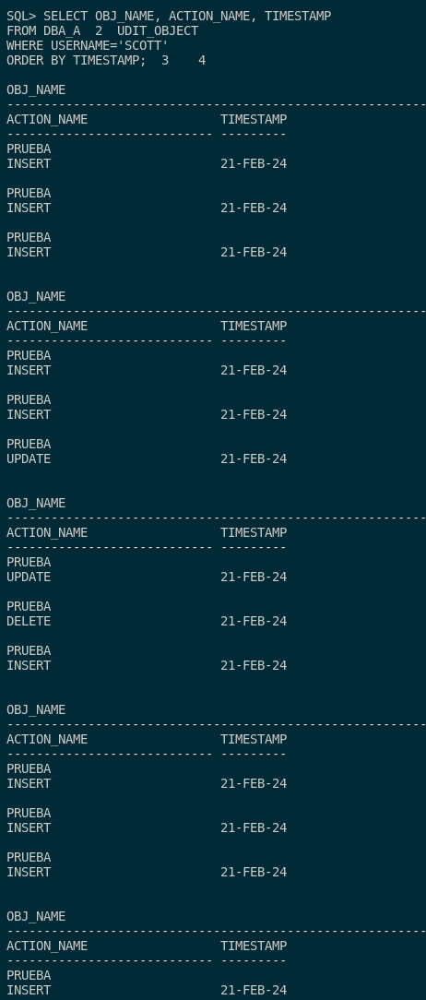
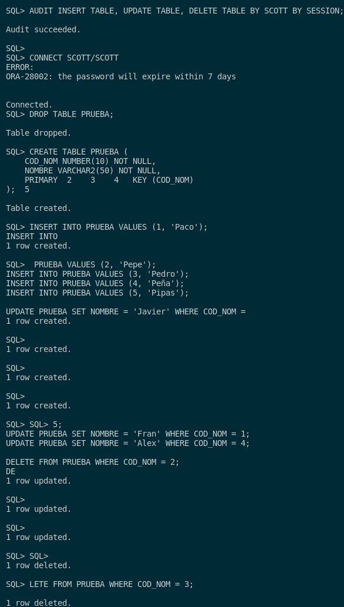
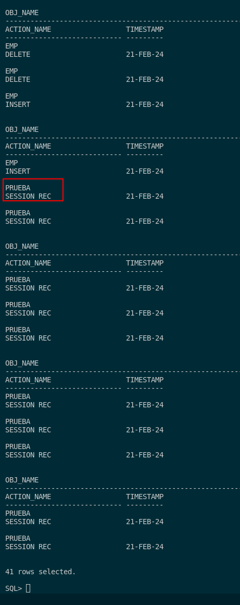

## 5. Explica la diferencia entre auditar una operación by access o by session ilustrándolo con ejemplos.

Antes de meternos en ver los ejemplos sobre las principales diferencias entre la auditoría by access y by session tenemos que entenderlas invididualmente.  

Por esto, debemos saber que **la auditoría by access** es un tipo de auditoría que nos registra uan entrada por cualquier operación DML que nosotros le ordenemos. Un ejemplo de la sintaxis es el siguiente:

```sql
AUDIT INSERT TABLE, UPDATE TABLE, DELETE TABLE BY SCOTT BY ACCESS;
```

Este nos puede servir para controlar las acciones primordiales como **INSERT, UPDATE y DELETE TABLE**. Por ejemplo, este lo utilizamos en el ejercicio 3 controlando la inserción, modificación y eliminación de los datos de nuesto usuario SCOTT (la consulta es la del ejercicio comentado).



También debemos saber que **la auditoría by session** es un tipo de auditoría que nos registra solo una entrada por sesión activa. Por ello, esta mejora mucho la escalabilidad y el rendimiento de los datos. Un ejemplo de esta sintaxis es el siguiente:

```sql
AUDIT INSERT TABLE, UPDATE TABLE, DELETE TABLE BY SCOTT BY SESSION;
```

Para la prueba de ello, voy a crear esta audioría, voy acceder al usuario SCOTT y le voy a meter datos para ver que este funciona correctamente. El código de prueba es el mismo que el del ejercicio 3 y la misma consulta.



Y realizamos la consulta como DBA:



Como podemos ver, nos guarda esta auditoría como una auditoría de sesión o by session.