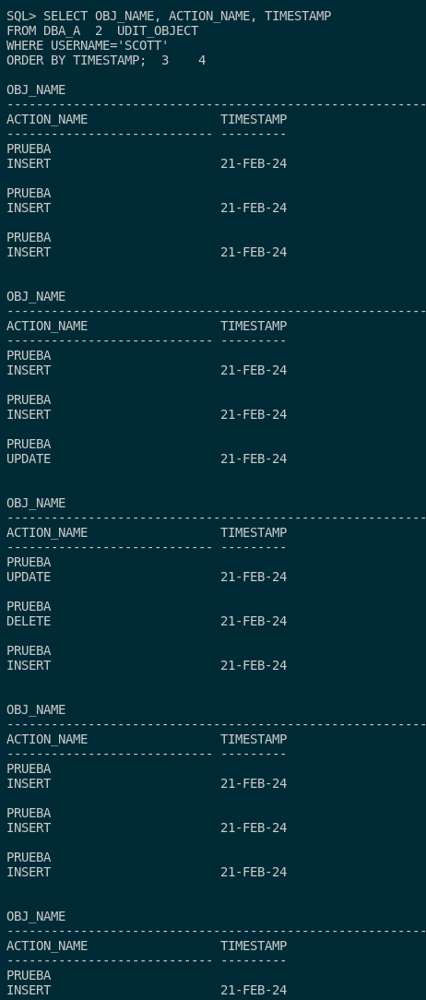

## 6. Documenta las diferencias entre los valores db y db, extended del parámetro audit_trail de ORACLE. Demuéstralas poniendo un ejemplo de la información sobre una operación concreta recopilada con cada uno de ellos.

Para poder entender las diferencias entre los valores db y db, extended del parámetro audit_trail en Oracle, tenemos que saber que hay 2 niveles de auditoría en el sistema. 

Estos 2 niveles son **db y db, extended** se diferencian principalmente que el primero no almacena ningun dato y el segundo guarda estos valores los datos de **SQLBIND** y **SQLTEXT** en la tabla **SYS.AUD$**.

Con esto dicho, para ver el valor por defecto de **audit_trail**, deberemos ejecutar la siguiente consulta:

```sql
SHOW PARAMETER audit_trail;
```


Para ver la información recolectada mediante la auditoría **db**, podemos utilizar la consulta del ejercicio 3:

```sql
SELECT OBJ_NAME, ACTION_NAME, TIMESTAMP
FROM DBA_AUDIT_OBJECT
WHERE USERNAME='SCOTT'
ORDER BY TIMESTAMP;
```



Podemos ver que todos estos datos están almacenados mediante auditoría db. Si queremos activar la auditoría **db, extended**:

```sql
ALTER SYSTEM SET audit_trail = DB,EXTENDED SCOPE=SPFILE;
```

Y para que los cambios surgan efecto, deberemos reinciar la base de datos para que se vean los cambios en el sistema y seguido de esto vemos el estado de **audit_trail**.

```sql
shutdown immediate;
startup;
SHOW PARAMETER audit_trail;
```


Para poder comprobar que la auditoría **db, extended** funciona, crearemos una tabla nueva en el usuario SCOTT con un dato que voy a insertar, mofidicar y eliminar para que se guarde en el registro. Estos son los comandos:

```sql
CONNECT SCOTT/SCOTT;

CREATE TABLE PRUEBAEXTEND (
    ID NUMBER(10) NOT NULL,
    NOMBRE VARCHAR2(50) NOT NULL,
    PRIMARY KEY (ID)
);

INSERT INTO PRUEBAEXTEND VALUES (1, 'PRUEBA DEL DB EXTENDED');

UPDATE PRUEBAEXTEND SET NOMBRE = 'PRUEBA' WHERE ID = 1;

DELETE FROM PRUEBAEXTEND WHERE ID = 1;
```


Con la inserción hecha, accedemos como DBA a la base de datos y ejecutamos la siguiente consulta para ver que los datos de las auditoría se han guardado correctamente en un nuevo fichero

```sql
SELECT USERNAME, ACTION_NAME, TIMESTAMP, OBJ_NAME, SQL_TEXT, SQL_BIND 
FROM DBA_AUDIT_OBJECT 
WHERE USERNAME='SCOTT';
```

Bajamos en la consulta y nos mostrará los datos que nos ha guardado mediante la auditoría **db, extended**.


