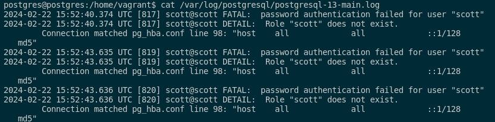
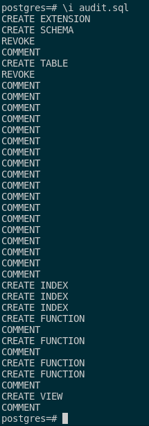
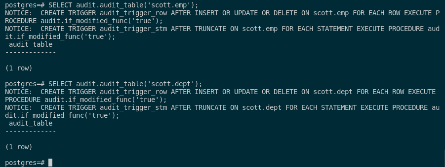
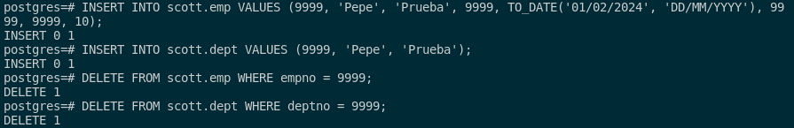
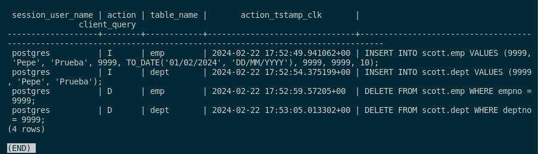

## 7. Averigua si en Postgres se pueden realizar los cuatro primeros apartados. Si es así, documenta el proceso adecuadamente.

La verificación de intentos de acceso fallidos a la base de datos no es similar a la de Oracle. Si deseamos revisar esos intentos, debemos consultar los registros de PostgreSQL.

Para empezar, nos conectaremos a la base de datos como el usuario scott y proporcionaremos una contraseña incorrecta y veremos los logs en ela siguiente ruta:

```sql
psql -h localhost -U scott -d scott

cat /var/log/postgresql/postgresql-13-main.log
```

En mi caso he intentado acceder y como no me ha dejado porque el rol no existe, se guardará en dicho log los errores que se comenten.



Lo malo de PostgreSQL es que no tiene una herramienta incorporada como tiene Oracle para realizar auditorías. Por ello, la comunidad de desarrolladores han creado una herramienta muy útil para este propósito, esta se llama **Audit trigger 91plus**. 

Esta utilidad nos posibilita realizar auditorías tanto de las operaciones DML (INSERT, UPDATE, DELETE) como de las DDL (CREATE, ALTER, DROP) en las tablas de la base de datos. Con esto dicho, pasamos a instalarla.

Primero, descargamos la herramienta con este comando:

```sql
wget https://raw.githubusercontent.com/2ndQuadrant/audit-trigger/master/audit.sql
```

Cuando ya la tengamos descargada, importamos este fichero sql para poder hacer las auditorías.

```sql
\i audit.sql
```



Con esta instalación del plugin para la auditoría, pasamos a la realización de los ejercicios. 

Como los primeros ejercicios nos pide que tengamos un control exhaustivo de este usuario SCOTT sobre todas las acciones DML que se pueden realizar en la base de datos, primero tendremos que indicar las tablas para que haga la auditoría solo a estas tablas. En este caso, se la haremos a las tablas EMP y DEPT:

```sql
SELECT audit.audit_table('scott.emp');
SELECT audit.audit_table('scott.dept');
```



Tras esto, deberemos pobrar que la auditoría funciona, vamos a insertar un registro en la tabla **emp y dept** por ejemplo:

```sql
INSERT INTO scott.emp VALUES (9999, 'Pepe', 'Prueba', 9999, TO_DATE('01/02/2024', 'DD/MM/YYYY'), 9999, 9999, 10);
INSERT INTO scott.dept VALUES (9999, 'Pepe', 'Prueba');

DELETE FROM scott.emp WHERE empno = 9999;
DELETE FROM scott.dept WHERE deptno = 9999;
```



Pasamos a comprobar que esta auditoría funciona con la siguiente consulta:

```sql
select session_user_name, action, table_name, action_tstamp_clk, client_query 
from audit.logged_actions;
```



Como vemos, la auditoría está funcionando correctamente. 
Nos está proporcionando información sobre: 

- El usuario que llevó a cabo la operación. 
- El tipo de operación realizada.
- La tabla en la que se ejecutó la operación. 
- La fecha y hora en que se realizó la operación.
- La consulta exacta realizada por el usuario. 

También se nos muestra que anteriormente, el usuario postgres eliminó dos registros antes de que el usuario scott insertara los suyos.

Si no queremos utilizar esta herramienta, podemos crear Triggers para realizar auditorías de las operaciones DML y DDL en nuestra base de datos. Para ver información sobre ello, lo explica muy bien en esta [documentación](https://wiki.postgresql.org/wiki/Audit_trigger).