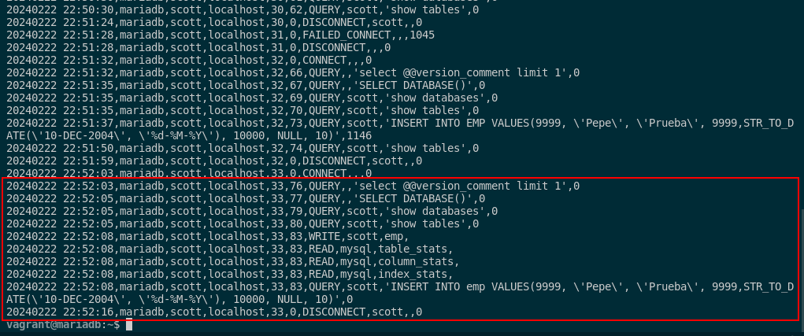

## 8. Averigua si en MySQL se pueden realizar los apartados 1, 3 y 4. Si es así, documenta el proceso adecuadamente.

Para poder realizar la auditorías en MySQL mediante logs predeterminados en el sistema, deberemos habilitar una línea de configuración en el fichero de configuración de MySQL. Para ello, debemos editar el fichero de configuración de MySQL:

```sql
sudo nano /etc/mysql/mariadb.conf.d/50-server.cnf
```

Y modficaremos las siguiente líneas añadiéndolas a este fichero:

```sql
general_log_file       = /var/log/mysql/mysql.log
general_log            = 1
log_error = /var/log/mysql/error.log
```


Estas líneas nos guardarán logs de esta base de datos en las rutas definidas. Cuando lo tengamos, tenemos que cambiar la propiedad el directorio de logs y reiniciamos el servicio. 

```sql
sudo chown mysql:mysql /var/log/mysql/
sudo systemctl restart mariadb
```


Para comprobar el funcionamiento, debemos tratar de iniciar sesión en la base de datos con un usuario que no exista y con un usuario que exista . Estos son los comandos en cuestión:

```sql
mysql -u noexiste -p
mysql -u root -p
```


Como podemos ver que he intentado acceder a un usuario que no existe y posteriormente he intentado acceder como root que he conseguido acceder una vez y 2 veces no por contraseña errónea. Esta auditoría mediante centralización de logs nos permite guardar toda la información sobre la base de datos, tanto inserts, como selects y como acceso a un usuario y una base de datos.

Pero esto no ejerce la función principal de la auditoría ya que MySQL no tiene por defecti ninguna herramienta para auditorías menos el control centralizado de logs de nuestra base de datos. Por ello, debemos utilizar un plugin adicional que se instala de la siguiente manera:

- Accedemos como root y instalamos el plugin:

```sql
INSTALL SONAME 'server_audit';
```


- Seguido de esto habilitamos el plugin accdiendo al fichero de antes para añadir la siguiente directiva:

```sql
sudo nano /etc/mysql/mariadb.conf.d/50-server.cnf

[server]
server_audit_events=CONNECT,QUERY,TABLE
server_audit_logging=ON
server_audit_incl_users=scott
```


- Seguido de esto, volvemos a reinciar el servicio de mariadb:

```sql
sudo systemctl restart mariadb
```

Y con esto, ya tenemos configurado el plugin de auditoría. Si queremos hacer una prueba lo que debemos hacer es insertar un valor de prueba como este en el usuario scott en la base de datos scott y miramos el log del plugin para ver que la auditoría funciona correctamente.

```sql
mysql -u scott -p
use scott
INSERT INTO emp VALUES(9999, 'Pepe', 'Prueba', 9999,STR_TO_DATE('10-DEC-2004', '%d-%M-%Y'), 10000, NULL, 10);
```


El log lo miraremos con el siguiente comando:

```sql
sudo cat /var/lib/mysql/server_audit.log
```



Y vemos que la auditoría funciona correctamente. Nos está mostrando: el usuario que ha realizado la operación, la operación que ha realizado, la tabla en la que ha realizado la operación, la fecha y hora en la que ha realizado la operación y la consulta que ha realizado el usuario (como en el de PostgreSQL que vimos anteriormente).