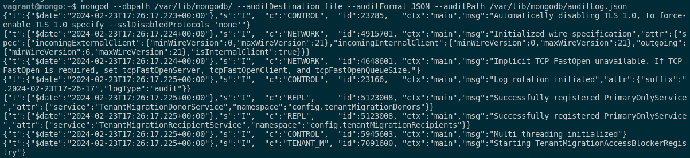
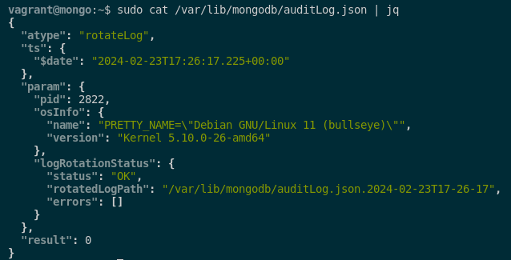
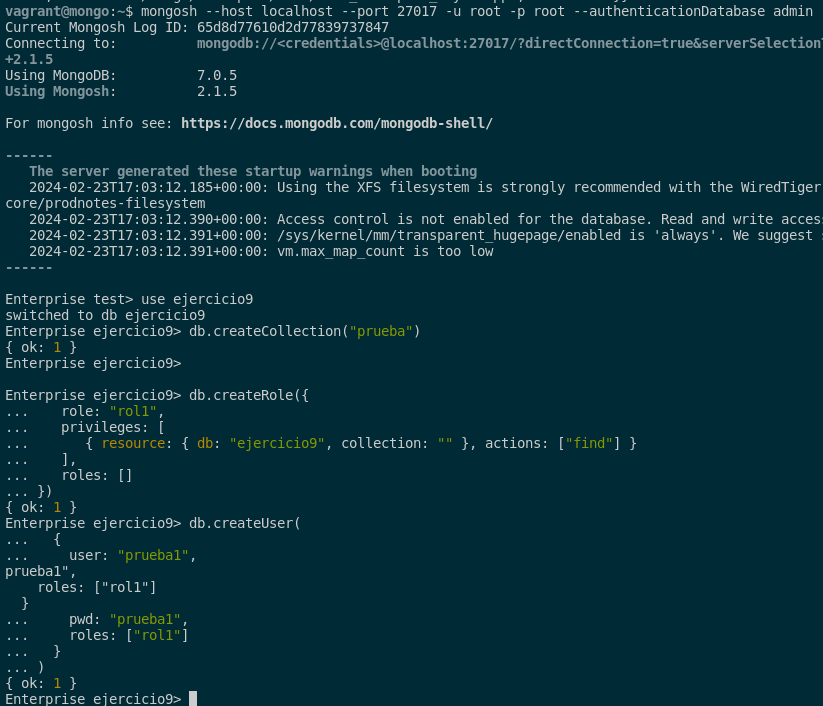
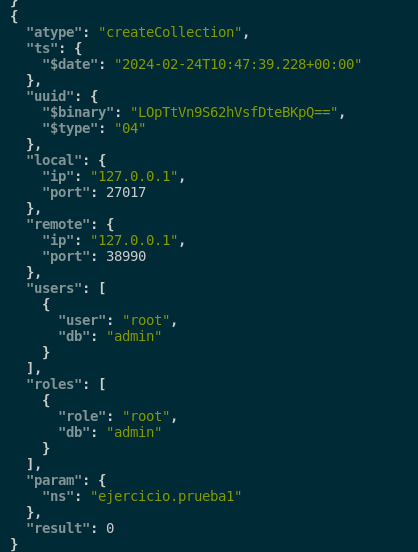
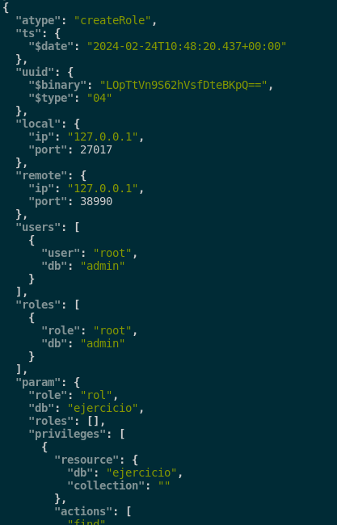
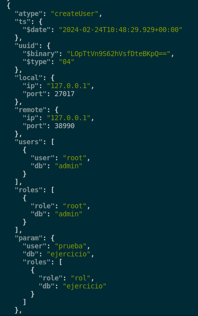
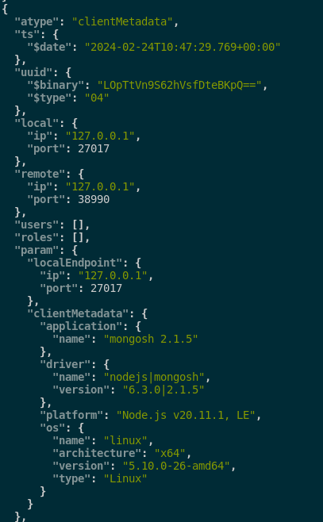
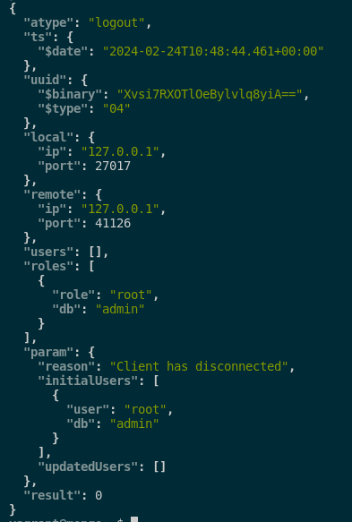

## 9. Averigua las posibilidades que ofrece MongoDB para auditar los cambios que va sufriendo un documento. Demuestra su funcionamiento.

Tenemos que saber que para poder realizar auditorías en MongoDB, debemos tener la versión Enterprise de este mismo. Con esto dicho, hay 3 tipos opciones a la hora de realizar una auditoría y estas son las siguientes:

- `Guardar en el syslog`: Los registros de auditoría se envían al sistema de registro del sistema operativo y este nos será muy útil para entornos con contenidos centralizados en distintas bases de datos.

- `Guardar en fichero JSON/BSON`: Los registros se almacenan en archivos en el sistema de archivos del servidor MongoDB, facilitando la revisión y el análisis de estas mismas.

- `Mostrar mediante consola`: Los registros de auditoría se muestran directamente en la consola de MongoDB que es muy útil a la hora de ver los logs en tiempo real.

Con esto comentado, tendremos que habilitar las auditorías, deberemos modificar el fichero de configuración de MongoDB o podemos hacerlo mediante comandos. Por ello pasamos a verlos 1 a 1.

**Para habilitar las auditorías mediante syslog:**

- Mediante fichero de configuración (lo añadimos en las respectivas líneas del fichero):

```sql
sudo nano /etc/mongod.conf

storage:
  dbPath: /var/lib/mongodb/
auditLog:
  destination: syslog
```

- Mediante comandos desde la consola:

```sql
mongod --dbpath /var/lib/mongodb/ --auditDestination syslog
```

**Para habilitar las auditorías mediante en un fichero JSON:**

- Mediante fichero de configuración (lo añadimos en las respectivas líneas del fichero):

```sql
sudo nano /etc/mongod.conf

storage:
  dbPath: /var/lib/mongodb/
auditLog:
  destination: file
  format: JSON
  path: /var/lib/mongodb/auditLog.json
```

- Mediante comandos desde la consola:

```sql
mongod --dbpath /var/lib/mongodb/ --auditDestination file --auditFormat JSON --auditPath /var/lib/mongodb/auditLog.json
```

**Para habilitar las auditorías mediante en un fichero BSON:**

- Mediante fichero de configuración (lo añadimos en las respectivas líneas del fichero):

```sql
sudo nano /etc/mongod.conf

storage:
  dbPath: /var/lib/mongodb/
auditLog:
  destination: file
  format: BSON
  path: /var/lib/mongodb/auditLog.bson
```

- Mediante comandos desde la consola:

```sql
mongod --dbpath /var/lib/mongodb/ --auditDestination file --auditFormat BSON --auditPath /var/lib/mongodb/auditLog.bson
```

**Para habilitar las auditorías mediante la consola:**

- Mediante fichero de configuración (lo añadimos en las respectivas líneas del fichero):

```sql
sudo nano /etc/mongod.conf

storage:
  dbPath: /var/lib/mongodb/
auditLog:
  destination: console
```

- Mediante comandos desde la consola:

```sql
mongod --dbpath /var/lib/mongodb/ --auditDestination console
```

Con esto dicho, yo voy a utilizar la auditoría mediante un fichero JSON ya que es lo más parecido a la sintaxis de MongoDB. Este nos lo da de manera legible y fácil. Yo lo he configurado mediante este comando explicado anteriormente:

```sql
mongod --dbpath /var/lib/mongodb/ --auditDestination file --auditFormat JSON --auditPath /var/lib/mongodb/auditLog.json
```



Tras esto, para comprobar que la auditoría funciona correctamente, vamos a mirar los logs de MongoDB desde la consola con un formato JSON para que sea más fácil de leer. Lo haremos mediante este paquete y lo miraremos en el siguiente fichero:

```sql
sudo apt install jq
sudo cat /var/lib/mongodb/auditLog.json | jq
```



Como hemos instalado MongoDB Entrerprise desde 0, tendremos que hacer algunas pruebas para ello crearemos una colección, un usuario, un insert, un rol y una consulta a la base de datos. Con esto dicho voy a mostrar los comandos en cuestión:

```sql
use ejercicio

db.createCollection("prueba1")

db.ejercicio.insertMany( [
  { nombre: "Pepe", id: 1 },
  { nombre: "Javier", id: 2 }
] )

db.createRole({
   role: "rol",
   privileges: [
      { resource: { db: "ejercicio", collection: "" }, actions: ["find"] }
   ],
   roles: []
})

db.createUser(
  {
    user: "prueba",
    pwd: "prueba",
    roles: ["rol"]
  }
)

db.ejercicio.find()
```



Ahora, vamos a mirar los logs de auditoría en nuestro fichero json con el siguiente comando:

```sql
sudo cat /var/lib/mongodb/auditLog.json | jq
```

Con esto, podemos ver:

- La creación de la colección:



- La creación del rol:



- La creación del usuario prueba:



- Podemos ver el acceso a la base de datos:



- Y también cuando cerró la sesión:



Como podemos ver la auditoría funciona correctamente y nos muestra información relevante que sucede en nuestra base de datos de MongoDB Enterprise.